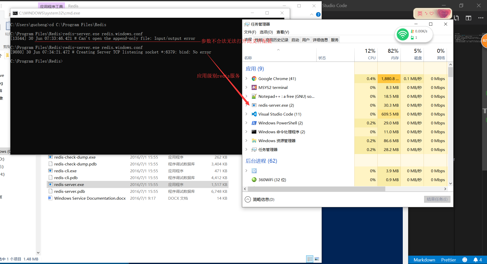

```
### redis安装 ####
```

第一步： 电脑安装redis => [redis下载地址](https://github.com/microsoftarchive/redis/releases) 安装符合电脑系统的(我的是win10 64bit )

第二步： 配置redis.windows.conf 参数 找到 appendonly no  把no改成yes

第三步： 开启redis服务 到安装目录打开cmd窗口 并输入命令： redis-server.exe redis.windows.conf

第四部： 双击redis-cli.exe应用程序(第一次开启redis-cli留意appendonly.aof文件，如果没有，一顿set get select 等操作还是没有appendonly.aof文件,就有2中可能，第一appendonly no, 第二，appendonly yes，但是开启的是应用级别redis服务，不是后台进程级别redis服务)，开始测试 set name xiaobai =>下方会输出 ok => get name => 下方输出 xiaobai

注意: (win10安装包即.msi)
* 不能 双击 redis-server.exe 开启服务

* 开启redis服务 查看任务管理器，如果在应用进程找到redis-server.exe 那么 配置redis.windows.conf 参数 appendonly yes不生效，即不能生成appendonly.aof文件,这点很重要

* win10安装包安装的redis配置可以尝试第三部，如果报参数不合法;在第三部基础上(前提任务管理器应用进程和后台进程都没找到，如果应用进程找到就skill进程) 把 redis.windows.conf 改成redis.windows.conf的绝对路径 这个值要用英文状态下的双引号包住，如果没报错就结束了，去查看任务管理器后台进程，如果找到redis服务，说明已经成功开启redis服务，如果找不到，说明两点，1曾经成功过，只是后台进程被杀死过，重新配置的服务计划本次无法生效，也无法生成appendonly.aof，或者在appendonly.aof文件记录，需要重启电脑；第2点，压根没成功





```

配置redis.windows.conf 参数 appendonly yes 成功的标记
1.redis-cli 任何操作 appendonly.aof都有记录
2.redis服务后台进程能够被找到
3.重启电脑或者重启redis服务 都能通过keys *命令在上次关闭redis服务并且有数据的数据空间找到键值
```

###  项目筹划 ###

* 1 创建项目目录

* 2 npm init 和 tsc --init初始化目录

* 3 cnpm i redis --save-dev 和 cnpm i @types/redis --save-dev (前者为js提供支持，后者为ts提供支持)

* 4 修改 tsconfig.json 中 "outDir"(ts转译js所在目录) "rootDir" (ts所在目录)

* 5 创建项目所需目录及文件

* 6 开始项目